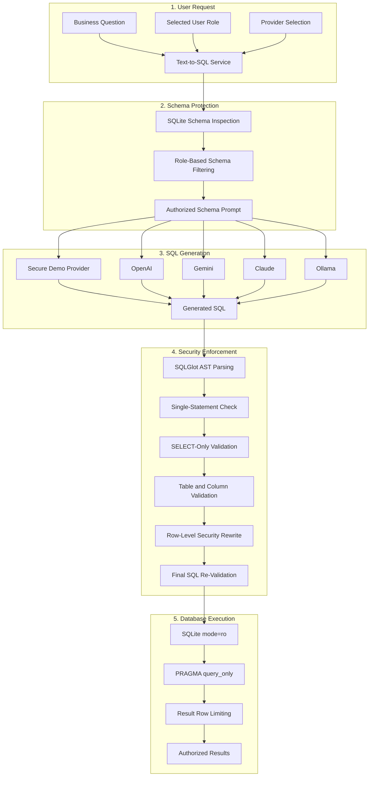

# Text-to-SQL with Guardrails

A secure multi-provider Text-to-SQL application that converts natural-language business questions into authorized SQLite queries using AST-based validation, role-based access control, row-level security, and read-only database execution.


---

## Overview

Text-to-SQL with Guardrails is a secure natural-language analytics application designed for authorized employees who need to explore structured business data without writing SQL manually.

The application converts a user question into SQL using a selected LLM provider. Generated SQL is never executed directly.

Before database execution, the system:

- Parses the query using SQLGlot
- Enforces a single-statement policy
- Allows only `SELECT` operations
- Validates requested tables and columns
- Applies role-based access control
- Injects row-level security restrictions when required
- Re-validates the rewritten SQL
- Executes the authorized query through a read-only SQLite connection
- Limits the number of returned rows

The generated SQL and the final authorized SQL remain visible separately, making the security process transparent to the user.

---

## Key Features

- Convert natural-language questions into SQL
- Support OpenAI, Gemini, Claude, and Ollama
- Provide a secure local demo provider for hosted demonstrations
- Inspect the SQLite database schema automatically
- Expose only role-authorized schema information to the LLM
- Parse generated SQL into an Abstract Syntax Tree
- Enforce a one-statement policy
- Allow only read-only `SELECT` queries
- Block unauthorized tables
- Block unauthorized columns
- Apply backend-enforced row-level security
- Re-validate SQL after security rewriting
- Execute queries using SQLite read-only mode
- Enable SQLite `PRAGMA query_only`
- Limit returned result rows
- Display generated and authorized SQL separately
- Provide safe and understandable error messages
- Include an interactive Streamlit interface
- Include automated tests using Pytest
- Separate safe public-demo behavior from full local-provider behavior

---

## Demo Workflow

1. Select a business role.
2. Choose one of the documented demonstration questions.
3. Allow the demo provider to generate the initial SQL.
4. Review the generated SQL.
5. Pass the query through SQLGlot validation.
6. Apply RBAC and row-level security rules.
7. Review the final authorized SQL.
8. Execute the query through the read-only SQLite connection.
9. Display the authorized result set.

Example workflow:

```text
Natural-Language Question
          |
          v
Role-Filtered Database Schema
          |
          v
Selected Text-to-SQL Provider
          |
          v
Generated SQL
          |
          v
SQLGlot AST Validation
          |
          v
RBAC and Row-Level Security
          |
          v
Authorized SQL
          |
          v
Read-Only SQLite Execution
          |
          v
Limited Query Results
```

---

## System Architecture



---

## Security Architecture

The project applies defense in depth rather than relying on prompt instructions alone.

| Layer | Security Control |
|---:|---|
| 1 | Send only the role-filtered schema to the selected provider |
| 2 | Apply shared Text-to-SQL prompt restrictions |
| 3 | Parse generated SQL using SQLGlot |
| 4 | Reject multiple SQL statements |
| 5 | Permit only `SELECT` queries |
| 6 | Validate tables against a role-specific allowlist |
| 7 | Validate requested columns against role permissions |
| 8 | Apply row-level security rewriting |
| 9 | Re-validate the rewritten SQL |
| 10 | Open SQLite using `mode=ro` |
| 11 | Enable `PRAGMA query_only` |
| 12 | Limit the maximum number of returned rows |

The LLM is responsible only for proposing SQL. Final authorization remains within the backend application.

---

## Roles and Permissions

The sample application includes three demonstration roles.

### Sales Analyst

The Sales Analyst can access:

- `customers`
- `orders`
- `order_items`
- `products`

Restrictions:

- No access to the `employees` table
- Restricted access to selected customer columns
- No row-level restriction

### Sales Manager

The Sales Manager can access:

- All sales-related tables
- The `employees` table
- Broader customer and employee information

Restrictions:

- No row-level restriction

### Account Manager

The Account Manager can access:

- Assigned customers only
- Orders related to assigned customers
- Order items related to assigned customers
- Product information

Restrictions:

- Backend-enforced row-level security
- No access to customers assigned to other account managers

> The role selector in the demonstration interface is not a production authentication system.

---

## Row-Level Security

Row-level security is enforced inside the backend and is not left to the LLM.

For the Account Manager role, the system modifies authorized queries so that the user can access only:

- Customers assigned to that account manager
- Orders associated with those customers
- Order items associated with those orders

The rewritten query is parsed and validated again before execution.

This means that even when the generated SQL does not contain the required ownership filter, the backend applies the restriction before the database query is executed.

---

## Application Modes

The project separates the hosted portfolio demonstration from full local experimentation.

| Mode | External API Keys | Available Providers | Intended Use |
|---|---|---|---|
| Public Demo | Not accepted | Secure Demo Provider | Hosted portfolio demonstration |
| Local Full | Supplied locally by the user | OpenAI, Gemini, Claude, Ollama | Full local experimentation |

---

## Public Demo Mode

Public Demo Mode is designed for safe hosted deployment.

In this mode:

- Visitors are not asked to provide API keys
- API keys are not accepted or processed
- No external LLM provider calls are made
- A deterministic local provider handles the documented example questions
- Generated SQL still passes through the real security pipeline
- SQLGlot validation remains active
- RBAC remains active
- Row-level security rewriting remains active
- Read-only SQLite execution remains active
- Generated SQL and authorized SQL remain visible separately

Public Demo Mode is the default when `APP_MODE` is not configured.

The hosted demonstration supports only the documented questions available in the sidebar.

---

## Local Full Mode

Local Full Mode enables external and local LLM providers.

Supported providers:

- OpenAI
- Google Gemini
- Anthropic Claude
- Ollama

Cloud-provider API keys are entered through a password-style field in the local interface for the current request.

Ollama requires a locally running Ollama server and does not require an API key.

Provider objects are constructed per request rather than being permanently cached.

The current interface does not intentionally write API keys to:

- Project files
- Application settings
- The SQLite database
- Explicit Streamlit session-state storage helpers

This behavior is useful for local experimentation but is not a replacement for production secret-management infrastructure.

---

## Sample Database

The repository includes a SQLite database containing fictional business information.

Tables:

```text
employees
customers
products
orders
order_items
```

The data includes orders from 2024 and 2025 across multiple:

- Regions
- Order statuses
- Customers
- Products
- Employees
- Account-manager assignments

The sample database supports demonstrations involving:

- Table joins
- Aggregations
- Revenue calculations
- Rankings
- Monthly analysis
- Regional analysis
- Customer analysis
- Employee portfolio analysis
- Role-based filtering
- Row-level security

---

## Supported Providers

### Secure Demo Provider

The Secure Demo Provider is used in Public Demo Mode.

It generates deterministic SQL for the documented example questions without making external API calls.

### OpenAI

Available in Local Full Mode using a user-supplied API key and model name.

### Google Gemini

Available in Local Full Mode using a user-supplied API key and model name.

### Anthropic Claude

Available in Local Full Mode using a user-supplied Anthropic API key and Claude model name.

### Ollama

Available in Local Full Mode through a locally running Ollama server.

No API key is required.

Model availability and supported model names depend on the selected provider and the user's local or cloud configuration.

---

## Tech Stack

| Category | Technology |
|---|---|
| Programming language | Python |
| User interface | Streamlit |
| Database | SQLite |
| SQL parsing and validation | SQLGlot |
| Data processing | Pandas |
| Testing | Pytest |
| OpenAI integration | OpenAI SDK |
| Gemini integration | Google GenAI SDK |
| Claude integration | Anthropic SDK |
| Local model integration | Ollama SDK |
| Configuration | Environment variables |
| Database security | Read-only URI mode and `PRAGMA query_only` |

---

## Project Structure

```text
Text-to-SQL-with-Guardrails/
├── app.py
│
├── assets/
│   ├── .gitkeep
│   ├── account-manager-rls.png
│   ├── sales-analyst-query.png
│   └── sales-manager-query.png
│
├── data/
│   ├── .gitkeep
│   └── company.db
│
├── scripts/
│   └── create_sample_db.py
│
├── src/
│   ├── __init__.py
│   ├── config.py
│   ├── database.py
│   ├── guardrails.py
│   ├── models.py
│   ├── rbac.py
│   ├── schema.py
│   ├── service.py
│   │
│   └── providers/
│       ├── __init__.py
│       ├── anthropic_provider.py
│       ├── base.py
│       ├── factory.py
│       ├── gemini_provider.py
│       ├── models.py
│       ├── ollama_provider.py
│       ├── openai_provider.py
│       └── prompt.py
│
├── tests/
│   ├── test_config.py
│   ├── test_database.py
│   ├── test_guardrails.py
│   ├── test_providers.py
│   ├── test_rbac.py
│   ├── test_sample_database.py
│   └── test_service.py
│
├── .env.example
├── .gitignore
├── README.md
└── requirements.txt
```

---

## Installation

### 1. Clone the repository

```bash
git clone https://github.com/Azoqoz/Text-to-SQL-with-Guardrails.git
cd Text-to-SQL-with-Guardrails
```

### 2. Create a virtual environment

#### Windows

```powershell
py -m venv .venv
.venv\Scripts\activate
```

#### macOS / Linux

```bash
python3 -m venv .venv
source .venv/bin/activate
```

### 3. Install the dependencies

#### Windows

```powershell
py -m pip install -r requirements.txt
```

#### macOS / Linux

```bash
python3 -m pip install -r requirements.txt
```

### 4. Create the sample database

#### Windows

```powershell
py scripts/create_sample_db.py
```

#### macOS / Linux

```bash
python3 scripts/create_sample_db.py
```

---

## Environment Configuration

Copy `.env.example` to `.env` and adjust the settings when needed.

```env
APP_MODE=local_full

DATABASE_PATH=data/company.db
MAX_RESULT_ROWS=200

LLM_PROVIDER=openai

OPENAI_MODEL=

GEMINI_MODEL=

ANTHROPIC_MODEL=

OLLAMA_HOST=http://localhost:11434
OLLAMA_MODEL=
```

### Available application modes

```text
public_demo
local_full
```

`APP_MODE` is case-insensitive and defaults to:

```text
public_demo
```

### Main settings

| Setting | Purpose |
|---|---|
| `APP_MODE` | Selects safe public-demo behavior or full local-provider behavior |
| `DATABASE_PATH` | Defines the SQLite database location |
| `MAX_RESULT_ROWS` | Limits the maximum number of query results |
| `LLM_PROVIDER` | Defines the default local provider |
| `OPENAI_MODEL` | Defines the OpenAI model name |
| `GEMINI_MODEL` | Defines the Gemini model name |
| `ANTHROPIC_MODEL` | Defines the Claude model name |
| `OLLAMA_HOST` | Defines the local Ollama server address |
| `OLLAMA_MODEL` | Defines the local Ollama model name |

API keys are intentionally not defined inside `AppSettings`.

In Local Full Mode, cloud-provider keys are entered through the Streamlit interface for the current request.

---

## Running the Application

### Public Demo Mode

Public Demo Mode is also used when `APP_MODE` is absent.

#### Windows PowerShell

```powershell
$env:APP_MODE = "public_demo"
py -m streamlit run app.py
```

#### macOS / Linux

```bash
export APP_MODE=public_demo
python3 -m streamlit run app.py
```

### Local Full Mode

#### Windows PowerShell

```powershell
$env:APP_MODE = "local_full"
py -m streamlit run app.py
```

#### macOS / Linux

```bash
export APP_MODE=local_full
python3 -m streamlit run app.py
```

Streamlit will display a local URL in the terminal, typically:

```text
http://localhost:8501
```

Open the displayed URL in your browser.

---

## Example Questions

### Sales Analyst

```text
What are the top 5 products by total completed-order revenue?

Show monthly completed-order revenue for 2025.

Which regions have the highest number of completed orders?

Which customers placed the most completed orders?
```

### Sales Manager

```text
Which employees manage the highest-revenue customer portfolios?

Show customer count by account manager.

Compare completed-order revenue by region.

Which products generate the most revenue?
```

### Account Manager

```text
Show my assigned customers.

Which of my customers generated the most revenue?

Show completed orders for my customers.

What products were purchased most by my customers?
```

---

## Testing

Run the complete automated test suite with:

### Windows

```powershell
py -m pytest
```

### macOS / Linux

```bash
python3 -m pytest
```

The test suite covers:

- Application configuration
- SQLite database access
- Read-only database execution
- SQL guardrail validation
- Provider behavior
- Role-based access control
- Row-level security
- Sample database integrity
- End-to-end service behavior

### Windows temporary-folder workaround

The following command can be used when local Windows permissions prevent Pytest from creating temporary files:

```powershell
$root = "D:\pytest_aziz"
New-Item -ItemType Directory -Path $root -Force | Out-Null

$run = Join-Path $root (
    "run_" + (Get-Date -Format "yyyyMMdd_HHmmss")
)

py -m pytest --basetemp="$run"
```

This external temporary folder is only a workaround for local Windows permission issues.

---

## Deployment

The application can be deployed using Streamlit Community Cloud in Public Demo Mode.

Recommended configuration:

```text
Repository: Azoqoz/Text-to-SQL-with-Guardrails
Branch: main
Main file path: app.py
```

Add the following Streamlit secret:

```toml
APP_MODE = "public_demo"
```

Because `public_demo` is the safe default, no Streamlit secret is required when no other configuration is needed.

The hosted deployment should not configure:

```text
OPENAI_API_KEY
GEMINI_API_KEY
ANTHROPIC_API_KEY
```

Public Demo Mode does not request visitor API keys and does not call external providers.

---

## Screenshots

### Account Manager — Row-Level Security


### Sales Analyst — Aggregated Sales Query


### Sales Manager — Broader Employee and Sales Access


---

## Extensibility and Real-World Use

The current implementation supports SQLite.

Its modular architecture separates:

- Provider integration
- Prompt generation
- Schema inspection
- SQL parsing
- SQL validation
- Role-based access control
- Row-level security
- Database execution
- User-interface logic

This structure can serve as a foundation for adding other relational databases.

Potential targets include:

- PostgreSQL
- MySQL
- Microsoft SQL Server

Supporting another database would require:

- A database-specific adapter
- The corresponding SQLGlot dialect
- Database-specific schema inspection
- A least-privilege read-only database user
- Adapted query execution
- Adapted row-level security rules
- Database-specific security testing

Other databases are not supported out of the box in the current repository.

In a real internal analytics environment, this architecture could help authorized employees explore approved company data without writing SQL, while keeping query authorization and database execution under backend control.

---

## Current Limitations

- Generated SQL may be syntactically safe but logically incorrect
- The demonstration role selector is not authentication
- The current database implementation supports SQLite only
- Other relational databases are not supported out of the box
- The application does not include a production identity provider
- The application does not include a query-cost estimator
- Sensitive-data masking is limited to configured column permissions
- Provider availability and model names may change
- Public Demo Mode supports only the documented example questions
- The system does not measure execution accuracy against a formal evaluation dataset
- Production deployment would require stronger identity and authorization integration
- Production deployment would require dedicated secret management
- Production deployment would require auditing and monitoring
- Production deployment would require rate limiting and least-privilege credentials

---

## Future Improvements

- Add production authentication
- Add identity-provider integration
- Store authorization policies in a database
- Add persistent audit logs
- Add query timeouts
- Add SQL complexity limits
- Add query-cost estimation
- Add sensitive-column masking
- Add an evaluation dataset
- Measure SQL execution accuracy
- Add PostgreSQL support
- Add MySQL and SQL Server adapters
- Add a FastAPI backend
- Add production secret management
- Add rate limiting
- Add Docker support
- Add continuous integration
- Add automated deployment

---

## Why This Project Matters

This project demonstrates that Text-to-SQL systems require more than prompt engineering.

A production-oriented system must treat LLM-generated SQL as untrusted input and validate it before database execution.

The project demonstrates practical AI Engineering and backend-security skills, including:

- Natural-language-to-SQL generation
- Multi-provider LLM integration
- Prompt and schema filtering
- Abstract Syntax Tree parsing
- SQL validation
- Role-based access control
- Column-level authorization
- Row-level security
- Query rewriting
- Read-only database execution
- Safe public-demo design
- Provider isolation
- Secure error handling
- Automated testing
- Streamlit application development
- Modular software architecture

The project shows how an LLM can be integrated with structured company data while keeping security and authorization decisions outside the model.

---

## Author

Developed by [Azoqoz](https://github.com/Azoqoz).
