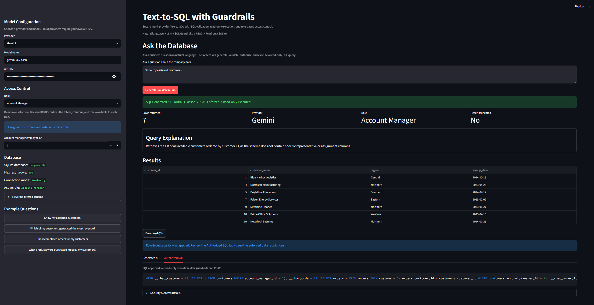
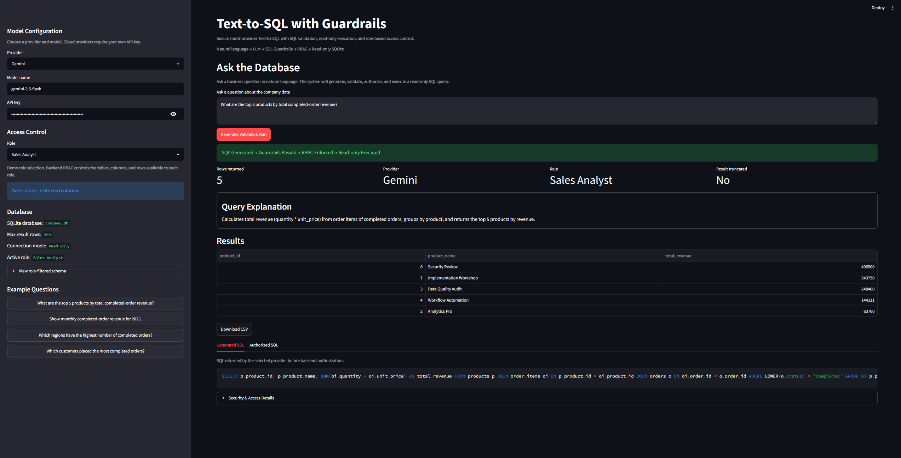
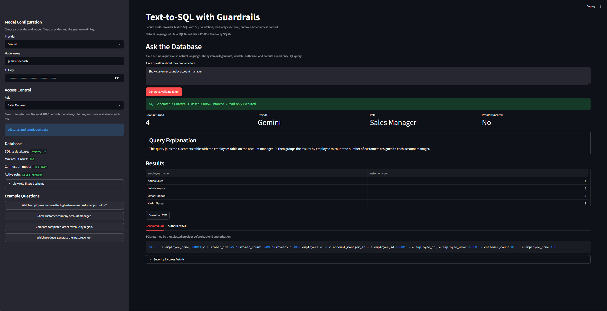

# Text-to-SQL with Guardrails

A secure multi-provider Text-to-SQL application that converts natural-language business questions into SQLite queries, validates them through AST-based SQL guardrails, enforces role-based access control, and executes only authorized queries through a read-only database connection.

## Overview

This project is designed for an authorized internal business employee asking natural-language questions over structured company data. The application sends only a role-filtered schema to the selected LLM provider, keeps generated SQL transparent, and never executes generated SQL directly. Before execution, SQLGlot guardrails and backend RBAC apply table, column, and row-level controls.

## Demo Workflow

User Question -> Role-Filtered Schema -> Selected Provider -> Generated SQL -> SQLGlot Guardrails -> RBAC Enforcement -> Read-only SQLite Execution -> Results

## Key Features

- Multi-provider LLM support
- Secure public demo provider plus OpenAI, Gemini, Claude, and Ollama in local mode
- SQLite schema inspection
- Role-filtered schema exposure
- AST-based SQL validation
- SELECT-only policy
- Table allowlisting
- Column-level permissions
- Row-level security
- Read-only execution
- Result limiting
- Generated and authorized SQL transparency
- Streamlit UI
- Safe error handling
- Automated tests

## Roles and Permissions

Sales Analyst:
- Access to customers, orders, order_items, and products
- No access to the employees table
- Restricted customer columns
- No row-level restriction

Sales Manager:
- Access to all sales tables
- Access to the employees table
- Broad sales access
- No row-level restriction

Account Manager:
- Access only to assigned customers
- Access only to related orders and order items
- Products remain available
- Backend-enforced row-level security

Role selection in the demo is not production authentication.

## Security Architecture

Defense in depth:

1. Role-filtered schema sent to the LLM
2. Shared prompt restrictions
3. SQLGlot AST parsing
4. One-statement policy
5. SELECT-only policy
6. Table allowlisting
7. Column-level validation
8. Row-level security rewriting
9. Re-validation after rewriting
10. SQLite `mode=ro`
11. `PRAGMA query_only`
12. Result row limiting

## Architecture

```text
Text-to-SQL-with-Guardrails/
├── app.py
├── assets/
│   ├── .gitkeep
│   ├── account-manager-rls.png
│   ├── sales-analyst-query.png
│   └── sales-manager-query.png
├── data/
│   ├── .gitkeep
│   └── company.db
├── scripts/
│   └── create_sample_db.py
├── src/
│   ├── __init__.py
│   ├── config.py
│   ├── database.py
│   ├── guardrails.py
│   ├── models.py
│   ├── rbac.py
│   ├── schema.py
│   ├── service.py
│   └── providers/
│       ├── __init__.py
│       ├── anthropic_provider.py
│       ├── base.py
│       ├── factory.py
│       ├── gemini_provider.py
│       ├── models.py
│       ├── ollama_provider.py
│       ├── openai_provider.py
│       └── prompt.py
├── tests/
│   ├── test_config.py
│   ├── test_database.py
│   ├── test_guardrails.py
│   ├── test_providers.py
│   ├── test_rbac.py
│   ├── test_sample_database.py
│   └── test_service.py
├── .env.example
├── .gitignore
├── README.md
└── requirements.txt
```

## Sample Database

The included SQLite database contains fictional business data:

- employees
- customers
- products
- orders
- order_items

Orders cover 2024 and 2025 with multiple regions and order statuses. The dataset is suitable for joins, aggregation, rankings, date analysis, and role-based filtering demonstrations.

## Supported Providers

- Secure Demo Provider in Public Demo Mode
- OpenAI
- Gemini
- Claude via Anthropic
- Ollama locally

OpenAI, Gemini, Claude, and Ollama are available in Local Full Mode. Cloud providers require the user's own API key, entered in the local UI for the current request. Ollama requires a local Ollama server and no API key.

Provider objects are constructed per request and are not cached. The application does not write API keys to project files, settings, databases, or explicit Streamlit session-state helpers. This UI behavior is not a substitute for production secret management.

Example model names vary by provider and availability. Enter the model name you intend to use in the UI.

## Hosted Demo Security

The hosted Streamlit application runs in Public Demo Mode. It does not request, accept, or process visitors' API keys and makes no external provider calls. Instead, it uses a deterministic local provider for the documented example questions.

The demo is not a simulated security result: generated SQL still passes through the real SQLGlot guardrails, RBAC enforcement, row-level security rewriting, and read-only SQLite execution. Generated SQL and authorized SQL remain visible separately.

Full OpenAI, Gemini, Claude, and Ollama support remains available in Local Full Mode. Cloud providers require the user's own API key when running locally; Ollama works locally without an API key. Public Demo Mode intentionally supports only the documented sidebar questions.

| Mode | External API Keys | Providers | Intended Use |
| --- | --- | --- | --- |
| Public Demo | Not accepted | Secure Demo Provider | Hosted portfolio demo |
| Local Full | User supplied locally | OpenAI, Gemini, Claude, Ollama | Full local experimentation |

### Streamlit deployment

The public Streamlit deployment should use:

```toml
APP_MODE = "public_demo"
```

It should not configure `OPENAI_API_KEY`, `GEMINI_API_KEY`, or `ANTHROPIC_API_KEY`. Because `public_demo` is the safe default, no Streamlit secret is required when no other configuration is needed.

## Extensibility and Real-World Use

> The project currently supports SQLite, while its modular architecture is designed to be extended to PostgreSQL, MySQL, SQL Server, and other relational databases through database-specific adapters.

The current implementation is fully functional with SQLite. The application architecture separates LLM providers, schema inspection, SQL validation, RBAC enforcement, database execution, and the Streamlit UI, which makes the project suitable as a foundation for other relational databases.

Supporting PostgreSQL, MySQL, SQL Server, or another database would require a database-specific adapter, the matching SQLGlot dialect, database-specific schema inspection, a read-only database user, and adapted row-level security and query execution where needed. Other databases are not supported out of the box in this repository.

In practical business use, authorized employees can ask questions about structured company data without writing SQL. This can reduce repeated manual reporting requests and help sales, operations, finance, and management teams explore approved data more quickly. Guardrails and RBAC provide a safer alternative to executing unrestricted LLM-generated SQL, and the same architecture could be integrated with an internal analytics platform or company database after adapting the database layer and production security controls.

## Installation

PowerShell:

```powershell
py -m venv .venv
.venv\Scripts\activate
py -m pip install -r requirements.txt
py scripts/create_sample_db.py
$env:APP_MODE = "local_full"
py -m streamlit run app.py
```

macOS/Linux:

```bash
python -m venv .venv
source .venv/bin/activate
python -m pip install -r requirements.txt
python scripts/create_sample_db.py
export APP_MODE=local_full
python -m streamlit run app.py
```

For safe public demo behavior, use `APP_MODE=public_demo` or omit `APP_MODE` entirely. For the full local provider UI, use `APP_MODE=local_full`.

PowerShell launch commands:

```powershell
# Public demo (also the default when APP_MODE is absent)
$env:APP_MODE = "public_demo"
py -m streamlit run app.py

# Full local providers
$env:APP_MODE = "local_full"
py -m streamlit run app.py
```

## Environment Configuration

`.env.example`:

```env
APP_MODE=local_full

DATABASE_PATH=data/company.db
MAX_RESULT_ROWS=200

LLM_PROVIDER=openai

OPENAI_MODEL=

GEMINI_MODEL=

ANTHROPIC_MODEL=

OLLAMA_HOST=http://localhost:11434
OLLAMA_MODEL=
```

`APP_MODE` accepts `public_demo` and `local_full` case-insensitively and defaults to `public_demo`. API keys are deliberately not part of `AppSettings`; in Local Full Mode, cloud-provider keys are entered through the password-style UI field for the current request.

## Example Questions

Sales Analyst:
- What are the top 5 products by total completed-order revenue?
- Show monthly completed-order revenue for 2025.
- Which regions have the highest number of completed orders?
- Which customers placed the most completed orders?

Sales Manager:
- Which employees manage the highest-revenue customer portfolios?
- Show customer count by account manager.
- Compare completed-order revenue by region.
- Which products generate the most revenue?

Account Manager:
- Show my assigned customers.
- Which of my customers generated the most revenue?
- Show completed orders for my customers.
- What products were purchased most by my customers?

## Testing

Standard command:

```powershell
py -m pytest
```

Windows temp-folder workaround used on this machine:

```powershell
$root = "D:\pytest_aziz"
New-Item -ItemType Directory -Path $root -Force | Out-Null
$run = Join-Path $root ("run_" + (Get-Date -Format "yyyyMMdd_HHmmss"))
py -m pytest --basetemp="$run"
```

The external temp folder is only a workaround for local Windows permission issues.

## Screenshots

### Account Manager — Row-Level Security



### Sales Analyst — Aggregated Sales Query



### Sales Manager — Broader Employee and Sales Access



## Limitations

- LLM SQL may be safe but logically incorrect
- Demo role selector is not authentication
- SQLite-focused implementation; other databases are not supported out of the box
- No production identity provider
- No query cost estimator
- No sensitive-data masking beyond configured permissions
- API availability and model names vary by provider
- Public Demo Mode supports only the documented example questions
- Production integration requires database-specific testing, authentication, secrets management, auditing, least-privilege credentials, rate limiting, and stronger authorization integration

## Future Improvements

- Real authentication
- Identity-provider integration
- Policy storage in a database
- Audit logs
- Query timeout and complexity limits
- Sensitive-column masking
- Evaluation dataset and execution accuracy metrics
- PostgreSQL support
- FastAPI backend
- Deployment

## Tech Stack

Python, Streamlit, SQLite, SQLGlot, Pandas, Pytest, OpenAI SDK, Google GenAI SDK, Anthropic SDK, Ollama SDK

## Project Status

The application includes a safe hosted demo mode and a separate local full-provider mode. Public Demo Mode exercises the complete backend security pipeline without collecting visitor API keys or calling external providers.

