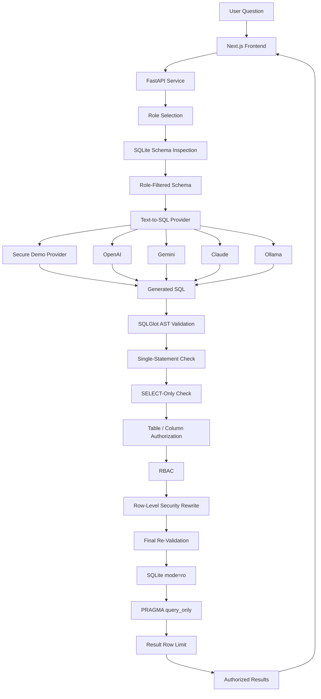
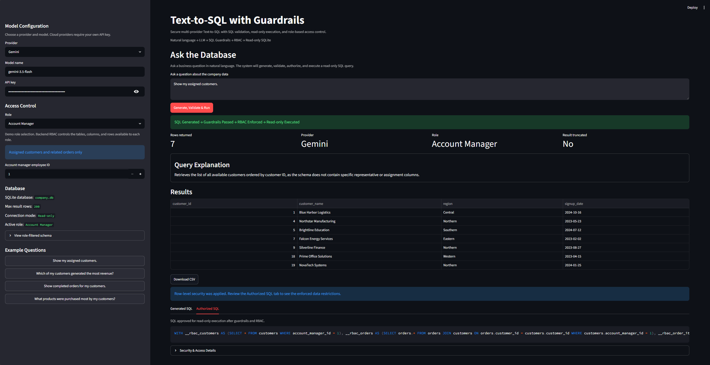
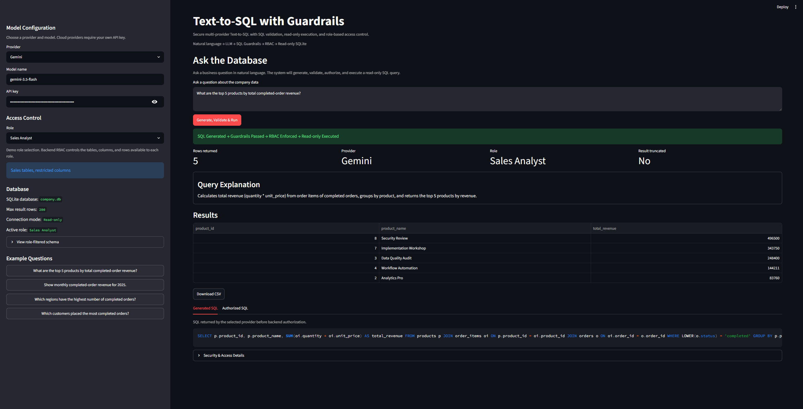
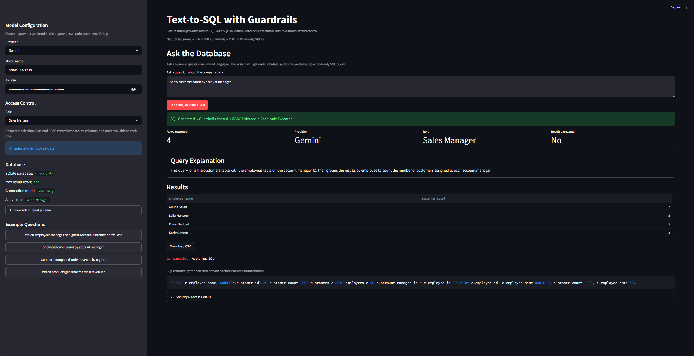

# Text-to-SQL with Guardrails

A full-stack Text-to-SQL application that converts natural-language business questions into authorized SQLite queries using Next.js, FastAPI, SQLGlot AST validation, role-based access control, row-level security, and read-only database execution.


---

## Live Application

**Web Application:**  
https://text-to-sql-with-guardrails.vercel.app/

> The hosted application runs in a restricted Public Demo Mode designed to demonstrate the real SQL security pipeline without requiring visitor API keys.

---

## Overview

Text-to-SQL with Guardrails is a secure natural-language analytics application designed for authorized users who need to explore structured business data without writing SQL manually.

A user asks a business question in natural language.

The application generates SQL, but generated SQL is never trusted or executed directly.

Before database execution, the backend:

- Inspects the database schema
- Filters schema information according to the selected role
- Generates candidate SQL
- Parses the query using SQLGlot
- Enforces a single-statement policy
- Permits only `SELECT` queries
- Validates requested tables
- Validates requested columns
- Applies role-based access control
- Injects row-level security when required
- Re-validates the rewritten query
- Opens SQLite in read-only mode
- Enables `PRAGMA query_only`
- Limits the maximum returned rows
- Executes only the final authorized SQL

The generated SQL and the final authorized SQL remain visible separately, making the security process inspectable instead of hiding authorization behind the model.

---

## Key Features

- Natural-language-to-SQL generation
- Modern Next.js production frontend
- FastAPI service layer
- Multi-provider LLM support
- OpenAI integration
- Google Gemini integration
- Anthropic Claude integration
- Local Ollama support
- Deterministic Secure Demo Provider
- Automatic SQLite schema inspection
- Role-filtered schema exposure
- SQLGlot AST parsing
- Single-statement enforcement
- `SELECT`-only execution
- Table-level authorization
- Column-level authorization
- Role-based access control
- Backend-enforced row-level security
- SQL security rewriting
- Post-rewrite validation
- SQLite read-only connection mode
- `PRAGMA query_only`
- Maximum-result-row limits
- Generated-vs-authorized SQL comparison
- Safe error handling
- Public Demo Mode
- Local Full Mode
- Automated Pytest coverage
- Vercel frontend deployment
- Legacy Streamlit interface retained for project history

---

## Query Workflow

```text
Natural-Language Question
          |
          v
Selected Business Role
          |
          v
Role-Filtered Database Schema
          |
          v
Text-to-SQL Provider
          |
          v
Generated SQL
          |
          v
SQLGlot AST Parsing
          |
          v
Single-Statement Validation
          |
          v
SELECT-Only Validation
          |
          v
Table / Column Authorization
          |
          v
Row-Level Security Rewrite
          |
          v
Final SQL Re-Validation
          |
          v
Read-Only SQLite Execution
          |
          v
Limited Authorized Results
```

The language model proposes SQL.

The backend decides whether that SQL is allowed to execute.

---

## System Architecture


```mermaid
flowchart TD
    A["User Question"] --> B["Next.js Frontend"]
    B --> C["FastAPI Service"]

    C --> D["Role Selection"]

    D --> E["SQLite Schema Inspection"]
    E --> F["Role-Filtered Schema"]

    F --> G["Text-to-SQL Provider"]

    G --> G1["Secure Demo Provider"]
    G --> G2["OpenAI"]
    G --> G3["Gemini"]
    G --> G4["Claude"]
    G --> G5["Ollama"]

    G1 --> H["Generated SQL"]
    G2 --> H
    G3 --> H
    G4 --> H
    G5 --> H

    H --> I["SQLGlot AST Validation"]
    I --> J["Single-Statement Check"]
    J --> K["SELECT-Only Check"]
    K --> L["Table / Column Authorization"]
    L --> M["RBAC"]
    M --> N["Row-Level Security Rewrite"]
    N --> O["Final Re-Validation"]

    O --> P["SQLite mode=ro"]
    P --> Q["PRAGMA query_only"]
    Q --> R["Result Row Limit"]
    R --> S["Authorized Results"]

    S --> B
```

---

## Security Architecture

The project applies defense in depth rather than relying on prompt instructions alone.

| Layer | Security Control |
|---:|---|
| 1 | Send only role-authorized schema information to the selected provider |
| 2 | Apply shared Text-to-SQL prompt restrictions |
| 3 | Parse generated SQL using SQLGlot |
| 4 | Reject multiple SQL statements |
| 5 | Permit only `SELECT` queries |
| 6 | Validate tables against role-specific permissions |
| 7 | Validate requested columns |
| 8 | Apply row-level security rewriting |
| 9 | Re-validate rewritten SQL |
| 10 | Open SQLite using `mode=ro` |
| 11 | Enable `PRAGMA query_only` |
| 12 | Limit the maximum number of returned rows |

The LLM is responsible only for proposing SQL.

Final authorization and database execution remain under deterministic backend control.

---

## Why Generated SQL Is Treated as Untrusted

An LLM may generate SQL that is:

- Syntactically invalid
- Outside the user's authorization scope
- Based on unauthorized tables
- Based on restricted columns
- Missing required ownership filters
- Destructive
- Multi-statement
- Logically incorrect

For this reason, prompt instructions are not treated as a security boundary.

Every generated query must pass through the deterministic guardrail pipeline before execution.

---

## Roles and Permissions

The sample application includes three demonstration roles.

### Sales Analyst

The Sales Analyst can access:

```text
customers
orders
order_items
products
```

Restrictions:

- No access to the `employees` table
- Restricted access to selected customer columns
- No row-level restriction

---

### Sales Manager

The Sales Manager can access:

- Sales-related tables
- The `employees` table
- Broader customer information
- Broader employee information

Restrictions:

- No row-level restriction

---

### Account Manager

The Account Manager can access:

- Assigned customers only
- Orders related to assigned customers
- Order items related to assigned customers
- Product information

Restrictions:

- Backend-enforced row-level security
- No access to customers assigned to other account managers

> The role selector used by the demonstration interface is not a production authentication system.

---

## Row-Level Security

Row-level security is enforced in backend application code.

It is not delegated to the LLM.

For the Account Manager role, the backend can rewrite otherwise valid SQL so that only authorized customer records are accessible.

```text
Generated SQL
      |
      v
Initial Validation
      |
      v
Role Authorization
      |
      v
RLS Rewrite
      |
      v
Second Validation
      |
      v
Read-Only Execution
```

The rewritten query is parsed and validated again before execution.

This means a query cannot bypass ownership restrictions simply because the selected model failed to include them.

---

## Generated SQL vs Authorized SQL

One important design decision is keeping both SQL representations visible.

### Generated SQL

The query proposed by the selected Text-to-SQL provider.

### Authorized SQL

The final query after:

- AST validation
- Single-statement validation
- `SELECT`-only validation
- Role authorization
- Column authorization
- Row-level security rewriting
- Final re-validation

This makes it possible to inspect when backend security modifies the model-generated query.

---

## Application Modes

The project separates the hosted portfolio demonstration from full local provider experimentation.

| Mode | External API Keys | Available Providers | Intended Use |
|---|---|---|---|
| Public Demo | Not accepted | Secure Demo Provider | Hosted portfolio demonstration |
| Local Full | Supplied locally | OpenAI, Gemini, Claude, Ollama | Full local experimentation |

---

## Public Demo Mode

Public Demo Mode is designed for safe hosted deployment.

In this mode:

- Visitors are not asked to provide API keys
- API keys are not accepted or processed
- No external LLM provider calls are made
- A deterministic local provider handles documented example questions
- Real SQLGlot validation remains active
- RBAC remains active
- Row-level security rewriting remains active
- Read-only SQLite execution remains active
- Generated SQL remains visible
- Authorized SQL remains visible
- Results come from the actual sample database

The hosted demonstration therefore exercises the real security pipeline instead of returning hard-coded final results.

Public Demo Mode is the safe default when `APP_MODE` is not configured.

---

## Local Full Mode

Local Full Mode enables external and local LLM providers.

Supported providers:

- OpenAI
- Google Gemini
- Anthropic Claude
- Ollama

Cloud-provider API keys are supplied locally by the user.

Ollama requires a locally running Ollama server and does not require an external API key.

Provider objects are constructed per request rather than being permanently cached.

Regardless of the selected model provider, generated SQL must pass through the same deterministic authorization and database-execution pipeline.

---

## Supported Providers

### Secure Demo Provider

Used in Public Demo Mode.

It generates deterministic SQL for supported example questions without making external API calls.

---

### OpenAI

Available in Local Full Mode using a user-supplied API key and model configuration.

---

### Google Gemini

Available in Local Full Mode using a user-supplied API key and model configuration.

---

### Anthropic Claude

Available in Local Full Mode using a user-supplied Anthropic API key and model configuration.

---

### Ollama

Available in Local Full Mode through a locally running Ollama server.

No external API key is required.

Model availability depends on the models installed locally.

---

## Sample Database

The repository includes a SQLite database containing fictional business information.

Tables:

```text
employees
customers
products
orders
order_items
```

The data includes orders from 2024 and 2025 across multiple:

- Regions
- Order statuses
- Customers
- Products
- Employees
- Account-manager assignments

The sample database supports demonstrations involving:

- Table joins
- Aggregations
- Revenue calculations
- Rankings
- Monthly analysis
- Regional analysis
- Customer analysis
- Product analysis
- Employee portfolio analysis
- Role-based filtering
- Row-level security

The dataset contains no real company or customer information.

---

## Example Questions

### Sales Analyst

```text
What are the top 5 products by total completed-order revenue?

Show monthly completed-order revenue for 2025.

Which regions have the highest number of completed orders?

Which customers placed the most completed orders?
```

---

### Sales Manager

```text
Which employees manage the highest-revenue customer portfolios?

Show customer count by account manager.

Compare completed-order revenue by region.

Which products generate the most revenue?
```

---

### Account Manager

```text
Show my assigned customers.

Which of my customers generated the most revenue?

Show completed orders for my customers.

What products were purchased most by my customers?
```

---

## Tech Stack

| Category | Technology |
|---|---|
| Production frontend | Next.js |
| Frontend language | TypeScript |
| Backend API | FastAPI |
| Backend language | Python |
| Database | SQLite |
| SQL parsing and validation | SQLGlot |
| Authorization | RBAC |
| Row-level security | Backend SQL rewriting |
| Data processing | Pandas |
| OpenAI integration | OpenAI SDK |
| Gemini integration | Google GenAI SDK |
| Claude integration | Anthropic SDK |
| Local LLM integration | Ollama |
| Testing | Pytest |
| Database protection | SQLite `mode=ro` + `PRAGMA query_only` |
| Frontend deployment | Vercel |
| Legacy interface | Streamlit |

---

## Project Structure

```text
Text-to-SQL-with-Guardrails/
│
├── frontend/
│   ├── app/
│   ├── components/
│   ├── lib/
│   ├── tests/
│   ├── .env.example
│   ├── .gitignore
│   ├── README.md
│   ├── eslint.config.mjs
│   ├── next-env.d.ts
│   ├── next.config.ts
│   ├── package-lock.json
│   ├── package.json
│   └── tsconfig.json
│
├── src/
│   ├── __init__.py
│   ├── config.py
│   ├── database.py
│   ├── guardrails.py
│   ├── models.py
│   ├── rbac.py
│   ├── schema.py
│   ├── service.py
│   │
│   └── providers/
│       ├── __init__.py
│       ├── anthropic_provider.py
│       ├── base.py
│       ├── factory.py
│       ├── gemini_provider.py
│       ├── models.py
│       ├── ollama_provider.py
│       ├── openai_provider.py
│       └── prompt.py
│
├── tests/
│   ├── test_config.py
│   ├── test_database.py
│   ├── test_guardrails.py
│   ├── test_providers.py
│   ├── test_rbac.py
│   ├── test_sample_database.py
│   └── test_service.py
│
├── assets/
│
├── data/
│   ├── .gitkeep
│   └── company.db
│
├── docs/
│
├── scripts/
│   └── create_sample_db.py
│
├── .devcontainer/
│
├── app.py
├── .env.example
├── .gitignore
├── requirements.txt
└── README.md
```

The repository retains the original Streamlit implementation in:

```text
app.py
```

The current portfolio-facing application uses the newer Next.js frontend and FastAPI service architecture.

---

## Installation

### 1. Clone the Repository

```bash
git clone https://github.com/Azoqoz/Text-to-SQL-with-Guardrails.git
cd Text-to-SQL-with-Guardrails
```

---

### 2. Create a Python Virtual Environment

#### Windows

```powershell
py -m venv .venv
.venv\Scripts\activate
```

#### macOS / Linux

```bash
python3 -m venv .venv
source .venv/bin/activate
```

---

### 3. Install Python Dependencies

#### Windows

```powershell
py -m pip install -r requirements.txt
```

#### macOS / Linux

```bash
python3 -m pip install -r requirements.txt
```

---

### 4. Create the Sample Database

#### Windows

```powershell
py scripts/create_sample_db.py
```

#### macOS / Linux

```bash
python3 scripts/create_sample_db.py
```

---

### 5. Install Frontend Dependencies

```bash
cd frontend
npm install
```

---

## Environment Configuration

Copy:

```text
.env.example
```

to:

```text
.env
```

Example backend configuration:

```env
APP_MODE=local_full

DATABASE_PATH=data/company.db
MAX_RESULT_ROWS=200

LLM_PROVIDER=openai

OPENAI_MODEL=
GEMINI_MODEL=
ANTHROPIC_MODEL=

OLLAMA_HOST=http://localhost:11434
OLLAMA_MODEL=
```

Available application modes:

```text
public_demo
local_full
```

`APP_MODE` is case-insensitive and defaults to:

```text
public_demo
```

### Main Settings

| Setting | Purpose |
|---|---|
| `APP_MODE` | Selects safe public-demo behavior or full local-provider behavior |
| `DATABASE_PATH` | Defines the SQLite database location |
| `MAX_RESULT_ROWS` | Limits the maximum number of returned rows |
| `LLM_PROVIDER` | Defines the default local provider |
| `OPENAI_MODEL` | Defines the OpenAI model |
| `GEMINI_MODEL` | Defines the Gemini model |
| `ANTHROPIC_MODEL` | Defines the Claude model |
| `OLLAMA_HOST` | Defines the local Ollama server |
| `OLLAMA_MODEL` | Defines the local Ollama model |

---

## Modern Frontend Development

The current production frontend lives inside:

```text
frontend/
```

Install dependencies:

```bash
cd frontend
npm install
```

Start the development server:

```bash
npm run dev
```

The Next.js development interface is normally available at:

```text
http://localhost:3000
```

The frontend communicates with the FastAPI service layer.

---

## Legacy Streamlit Interface

The original Streamlit application is still available for local experimentation.

### Public Demo Mode

#### Windows PowerShell

```powershell
$env:APP_MODE = "public_demo"
py -m streamlit run app.py
```

#### macOS / Linux

```bash
export APP_MODE=public_demo
python3 -m streamlit run app.py
```

---

### Local Full Mode

#### Windows PowerShell

```powershell
$env:APP_MODE = "local_full"
py -m streamlit run app.py
```

#### macOS / Linux

```bash
export APP_MODE=local_full
python3 -m streamlit run app.py
```

The legacy Streamlit interface normally runs at:

```text
http://localhost:8501
```

---

## Running with Ollama

Ollama allows local Text-to-SQL generation without a cloud API key.

Start a supported local model through Ollama and configure:

```env
OLLAMA_HOST=http://localhost:11434
OLLAMA_MODEL=<your-local-model>
```

Then run the application in:

```text
local_full
```

and select Ollama as the provider.

Generated SQL still passes through the same deterministic guardrail pipeline.

---

## Testing

Run the Python test suite with:

### Windows

```powershell
py -m pytest
```

### macOS / Linux

```bash
python3 -m pytest
```

The test suite covers:

- Application configuration
- SQLite database access
- Read-only database execution
- SQL guardrail validation
- Provider behavior
- Role-based access control
- Row-level security
- Sample database integrity
- End-to-end service behavior
- Public-demo guardrail behavior

The exact test count should be taken from the latest local run because the project continues to evolve.

---

### Windows Temporary-Folder Workaround

If local Windows permissions prevent Pytest from creating temporary files:

```powershell
$root = "D:\pytest_aziz"

New-Item -ItemType Directory -Path $root -Force | Out-Null

$run = Join-Path $root (
    "run_" + (Get-Date -Format "yyyyMMdd_HHmmss")
)

py -m pytest --basetemp="$run"
```

This folder is only a workaround for local Windows permission issues.

---

## Deployment

The modern application separates the production frontend from the backend service.

### Frontend — Vercel

Production application:

```text
https://text-to-sql-with-guardrails.vercel.app/
```

Configuration:

```text
Platform: Vercel
Framework: Next.js
Root Directory: frontend
Branch: main
```

The deployed frontend connects to the FastAPI service through its configured API base URL.

The frontend includes handling for backend cold-start behavior so the interface can recover when a free backend instance needs time to wake.

---

### Backend Service

The current architecture exposes the Text-to-SQL application logic through FastAPI.

The backend remains responsible for:

- Schema inspection
- Provider orchestration
- SQL parsing
- SQL validation
- RBAC
- Row-level security
- Query rewriting
- Read-only SQLite execution
- Result limiting

Security enforcement therefore remains server-side rather than moving into the browser.

---

## Legacy Deployment

The original project supported Streamlit Community Cloud using:

```text
app.py
```

That deployment architecture is retained only as part of the project's development history.

The current portfolio-facing frontend is:

```text
Next.js on Vercel
```

---

## Screenshots

The repository also retains screenshots from earlier development stages.

### Account Manager — Row-Level Security



### Sales Analyst — Aggregated Sales Query



### Sales Manager — Broader Employee and Sales Access



---

## Extensibility and Real-World Use

The current database implementation supports SQLite.

Its modular architecture separates:

- Provider integration
- Prompt construction
- Schema inspection
- SQL parsing
- SQL validation
- Role-based access control
- Row-level security
- Database execution
- API behavior
- Frontend behavior

This architecture could serve as a foundation for additional relational databases.

Potential future targets include:

```text
PostgreSQL
MySQL
Microsoft SQL Server
```

Supporting another database would require:

- A database-specific adapter
- An appropriate SQLGlot dialect
- Database-specific schema inspection
- Least-privilege read-only credentials
- Adapted query execution
- Adapted row-level security logic
- Database-specific security testing

These databases are not supported out of the box by the current repository.

---

## Current Limitations

- Generated SQL may be syntactically safe but logically incorrect
- The demonstration role selector is not authentication
- The current database implementation supports SQLite only
- Other relational databases are not supported out of the box
- The application does not include a production identity provider
- The application does not include a query-cost estimator
- Sensitive-data masking is limited to configured column permissions
- Provider availability and model names may change
- Public Demo Mode supports only documented example questions
- The system does not currently measure SQL execution accuracy against a formal evaluation dataset
- Production use would require stronger identity and authorization integration
- Production use would require dedicated secret management
- Production use would require persistent audit logging
- Production use would require monitoring
- Production use would require rate limiting
- Production databases would require least-privilege service credentials

---

## Future Improvements

- Add production authentication
- Add identity-provider integration
- Store authorization policies in persistent storage
- Add persistent audit logs
- Add query timeouts
- Add SQL complexity limits
- Add query-cost estimation
- Add sensitive-column masking
- Add a formal Text-to-SQL evaluation dataset
- Measure SQL execution accuracy
- Add PostgreSQL support
- Add MySQL support
- Add Microsoft SQL Server support
- Add production secret management
- Add rate limiting
- Add Docker support
- Add continuous integration
- Add automated deployment
- Add structured observability
- Add query tracing
- Add database-level policy integration
- Add model-provider monitoring

---

## Why This Project Matters

Text-to-SQL systems require more than prompt engineering.

A production-oriented system must treat LLM-generated SQL as untrusted input and validate it before database execution.

This project demonstrates practical AI Engineering and backend-security concepts including:

- Natural-language-to-SQL generation
- Multi-provider LLM integration
- Schema filtering
- Prompt construction
- Abstract Syntax Tree parsing
- SQL validation
- Role-based access control
- Column-level authorization
- Row-level security
- SQL rewriting
- Post-rewrite validation
- Read-only database execution
- Result limiting
- Secure public-demo design
- Provider isolation
- Safe error handling
- FastAPI service architecture
- Next.js frontend development
- Frontend / backend separation
- Automated testing
- Production deployment
- Modular software architecture

The project demonstrates how an LLM can interact with structured business data while keeping security, authorization, query rewriting, and database execution outside the model.

---

## Author

Developed by [Azoqoz](https://github.com/Azoqoz).
